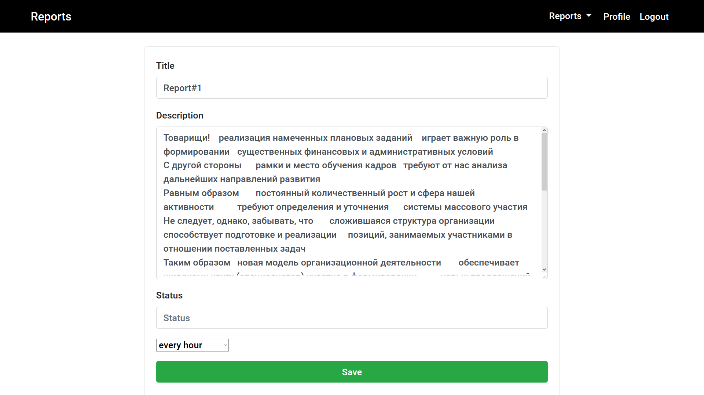
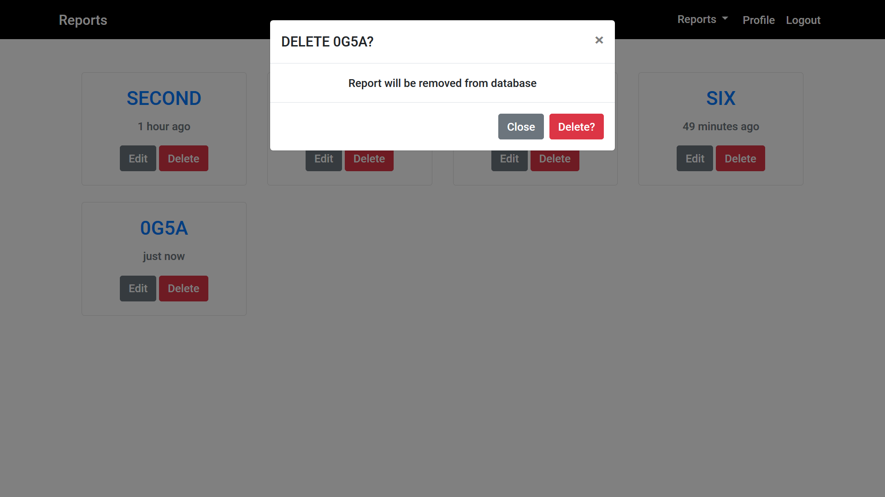

# Reporter
Reporter is a [Node-Express](https://expressjs.com) server for create and edit (reports, to do lists and everything you need access to) with multiple users.

- [Reporter](#reporter)
  - [Features](#features)
  - [Installation](#installation)
  - [Usage](#usage)
  - [Quick start](#quick-start)
  - [Update](#update)
    - [dependencies](#dependencies)
  - [Settings](#settings)
    - [EXAMPLE:](#example)
  - [Screenshots](#screenshots)

---
## Features
CRUD(Create, READ, Update, Delete) Cards with Title, Description, Status, DateTime.

Password-hashing 

JSON Web Tokens

Session control

## Installation

```bash
git clone https://github.com/Sarmirim/Reporter.git && cd ./Reporter
npm install
```
---
## Usage

```bash
npm run server  // node index.js
```

or

```bash
npm run dev     // nodemon index.js
```
---
## Quick start
1. Create database from [TESTDB.sql](./TESTDB.sql)

2. Apply your MySQL settings in [keys.js](./src/keys.js) or create .env file like
[Example](#EXAMPLE:) with your database settings

3. Browser: <localhost:5000>

---

## Update 
### dependencies
```bash
npm-check-updates -u
npm install
```

---

## Settings

### EXAMPLE:

```ini
DATABASE_USER='user'
DATABASE_HOST='localhost'
DATABASE_PASSWORD='password'
DATABASE_NAME='db'
PORT=5000
```
---

## Screenshots




